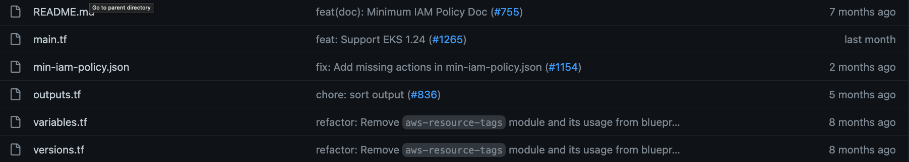

# Cloudfairy

Cloudfairy is a tool that helps you genarate and automate your cloud infrastructure resources.

## Requirements

- Node.js 16+

## Features

- Deploy and manage cloud resources

- Easily switch between different cloud providers
- Supports multiple cloud platforms including AWS, GCP, and Azure
- Provides real-time updates on resource deployment
- User-friendly interface by UI and cli.

## Installation

To start using Cloudfairy CLI, run the following command:

```
update/install npm
# npm install -g npm@9.2.0

install cloudfairy
# npm i -g @cloudfairy/cli
```

## usage

```
fairy init
```

define default library.

fairy project|p [options] [command] :

```

Options:
  -h, --help                                                               display help for command

Commands:
  init [project-name]                                                      Initialize an empty infrastructure
  info|i [options]                                                         Show infrastructure information
  remove-component|rmc <name>
  describe-component|describe <name>
  rename-component|ren <name> <new-name>
  connect-component|connect <from-component-id> <to-component-id>
  disconnect-component|disc <from-component-id> <to-component-id>
  configure-component-property|c [options] [component] [property] [value]
  set-cloud-provider|scp [cloud-provider]
  deploy
  add-component|add [options] [component-kind] [name]
  disconnect-component|disc <from-component-id> <to-component-id>
  help [command]
```

fairy library|l [options] [command] :

```
Manage component libraries

Options:
  -h, --help          display help for command

Commands:
  add <name> <path>
  list|ls
  info <name>
  update
  remove|rm <name>
  set-default <name>
  help [command]      display help for command
```

Now lets have a look how to adjust [eks bluprint module](https://github.com/aws-ia/terraform-aws-eks-blueprints/tree/main/examples/eks-cluster-with-new-vpc)
to be applied by cloudfairy tool :



as we can see the module has inputs configured in variable.tf file and outpusts configured in outputs.tf

project- shared properties.

```
variable properties {
  type = any
}

```

properties- inputs of the module - inserted by user or as defaults.

```
variable properties {
  type = any
}

```

cfout- object of mapped variable presenting the ouput of the module.

```

output "cfout" {
  value = {
    name                   = module.eks.name
    host                   = data.aws_eks_cluster.eks.endpoint
    cluster_ca_certificate = base64decode(data.aws_eks_cluster.eks.certificate_authority.0.data)
    token                  = data.aws_eks_cluster_auth.eks.token
  }
  sensitive = true
}
```

dependency - maped variables injected from "cfout" object of the depend module

```
variable "dependency" {
  type = any
}
```
# Components
## Network

This component creates vpc with two AZ's in two regions as default. It also creates two private subnets and two public subnets.
If asked to have it publicly accessible a NAT gateway will also be created.

arguments:
vpc_name             - The name of newly created VPC.
cidr_block           - The IP CIDR block for the entire VPC. Two options are available to choose from: '10.0.0.0/16' or '172.31.0.0/16'.
enable_public_access - Does the VPC need to be available externally. If true creates NAT Gateway attached to Elastic IP.

## Subnet

This component creates a single subnet in a chosen region.

arguments:
subnet_name - The name of the subnet to be created.
cidr        - The part of the CIDR network specific to this subnet. This argument depends on the CIDR block we chose in the network section.
              So our network cidr block is 172.31.0.0 and the subnet cidr is 7.0/24 then the final subnet cidr will be 172.31.7.0/24 .
az          - The name of the Availability zone in which to create the subnet.

## Storage

This component creates a bucket on the cloud provider.

arguments:
storage_name - The name of the bucket to be created.
acl          - The Access-Level attached to the bucket. There are six options: private, public-read, public-read-write, authenticated-read, aws-exec-read, log-delivery-write.

## Cluster

This component creates a managed Kubernetes cluster.

arguments:
name                 - The name of the cluster. The created cluster will have the following name structure: <Cluster_name>-<Environment>-<Project>-<ProjectID>.
k8s_version          - K8S version number. There are five options to choose from v1.22 to v1.26.
enable_public_access - boolean argument whether this managed cluster needs to be publicly accessible. If true it creates public endpoint for the cluster. (default: true)

## DB

This component creates a managed Relational Database in the cloud.

arguments:
name            - The name of the DB to be created.
engine          - choose which type of managed DB you want to use. There are three options: MySQL, PostgreSQL, MariaDB.
size            - What is the size of the DB in GB. (defualt: 5)

## Certificate

This component creates a managed certificate.
Note: In order for other resources to use this certificate you must make sure it is created in the same region as the resource using it. 
      For example: a Load-Balancer created in the Service component.

arguments:
hostname      - The hostname we ask to protect with this certificate. The default is *.<Project>.<hosted_zone>
region        - The region where to create the certificate.

## Instance

A Linux compute instance to create. 

arguments:
instance_name  - The name of the server we want to create.

## Security Group

A security group to permit only specific type of protocol. 
The entire list of rules that can be chosen is available here: https://github.com/terraform-aws-modules/terraform-aws-security-group/blob/master/modules/README.md .

arguments:
sg_name      - The name of the security group.
rule         - what type of rule we want to enforce in the Security Group. (default: "all-all")
block        - To which IP range will this security group be applied. (default: "0.0.0.0/0")

## Service

This component asks a path to a Dockerfile and creates a number of kuberenets object: ServiceAccount, Deployment, Service.
In case we need our service to be available externally an Ingress will be created too and as a result so will an Application Load Balancer.
In the end of the run two scripts will be created: 
- <service_name>.docker-build.ci.sh which can be used to build the docker image.
- <service_name>.cloudfairy-lifecycle.sh which can be used to run the build script and apply all created yaml files.

arguments:
service_name     - The name of the service and the deployment.
dockerfile_path  - a relative path from our project file where the Dockerfile of our application is located.
container_port   - in which port does our container exposed. (dedault: "8080")
debugger_port    - which port will be used for debugging. 
isexposed        - whether our service component will be externally available. (default: "True")

## Docker

This component works similary to the service component but instead of asking for a Dockerfile it asks for a ready docker image from Dockerhub.

arguments:
service_name     - The name of the service and the deployment.
dockerhub_image  - a Docker image from Dockerhub to be used as the application.
container_port   - in which port does our container exposed. (dedault: "8080")
env_vars         - What environment variables we want to expose to our deployment.
isexposed        - whether our service component will be externally available. (default: "True")

## ArgoCD

This component installs ArgoCD in it's own namespace in a previously created kubernetes cluster.
Before we must create a cluster and certificate in the same region as our cluster.

arguments:
appname        - a name for ArgoCD application to deploy immediatly after ArgoCD is installed. By default no app will be created (default: "")
repo           - Repository URL in which our application files are located.
path           - a relative path in the repository for our application files.
branch         - in which branch our application files are located. (default: "HEAD")
repo_type      - whether this is a Helm repository or Git repository. In case of Helm the path argument will be ignored.
ssh_publickey  - the public key used to authenticate with the Git repository in SSH. For example: 'ssh-ed25519 AAAA........' .
In order for it to work we must also create a secret with our private key in the following form:  "private_key-<Project>-<Environment>".

## ArgoCD Application

This component is used to install a single ArgoCD application. It could be located in Helm repository or Git repository.

arguments:
appname        - a name for ArgoCD application to deploy. (default: "")
repo           - Repository URL in which our application files are located.
path           - a relative path in the repository for our application files.
branch         - in which branch our application files are located. (default: "HEAD")
repo_type      - whether this is a Helm repository or Git repository. In case of Helm the path argument will be ignored.
ns             - in which namespace we want to deploy our application.

## Public Website

This component creates a bucket with CDN distribution to expose it via https. It redirects http traffic to https.
After the creation instructions would show how to upload files to our bucket and those will be used as the static files in our website.

bucketName      - the name of the bucket. The website name will be in the form of: <bucketName>-<Environment>.<Project>.<hosted_zone>
indexPage       - file name of the primary file to be presented by the website. (default: index.html)
errorPage       - file name to be presented in case of an error during browsing. (default: error.html)

# Onboarding as user

## Azure

Prerequisites:

- Tenant Id
- Subscription Id
- Client Id
- Client Secret
- Resource Group for the terraform state management
- Storage Account for terraform state
- Storage container in that account

```bash
# Login to azure cloud
az login

# Create resource group
az group create --name $RESOURCE_GROUP_NAME --location $location

# Create storage account
az storage account create --resource-group $RESOURCE_GROUP_NAME --name $STORAGE_ACCOUNT_NAME --sku Standard_LRS --encryption-services blob

# Create blob container
az storage container create --name $CONTAINER_NAME --account-name $STORAGE_ACCOUNT_NAME
```
